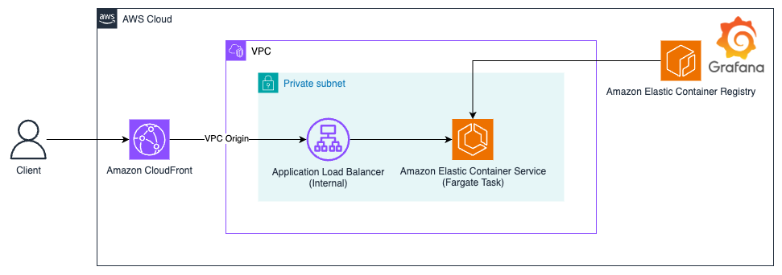

# Self-Hosted Grafana (OSS) on Amazon ECS (Fargate) 

This repository deploys a self-hosted Grafana (OSS) on Amazon Elastic Container Service (Fargate Task) running securely behind CloudFront and an internal Application Load Balancer (ALB) via CloudFront VPC Origins. Users access Grafana over HTTPS. This project is designed to help developers quickly experiment with self-hosted Grafana on AWS.

Important: This is a development or experimental setup and is not production-ready. See also [Known Limitations](#known-limitations).

## Architecture



## Project Structure

```
├── config.tfvars.example.json       
├── Dockerfile 
├── build-and-push.sh                      
├── resources/                       
│   └── architecture.png               
└── terraform/                       
    ├── cloudfront.tf
    ├── main.tf
    ├── outputs.tf
    ├── secrets.tf
    └── variables.tf
```

## Pre-requisites

* [An AWS account](https://console.aws.amazon.com/console/home?nc2=h_ct&src=header-signin)
* [Docker](https://docs.docker.com/engine/install/) installed and running on your machine (for building and pushing the Grafana image)
* [AWS CLI](https://docs.aws.amazon.com/cli/latest/userguide/getting-started-install.html) installed and configured with appropriate [AWS profile](https://docs.aws.amazon.com/cli/v1/userguide/cli-configure-files.html)
* [Terraform](https://developer.hashicorp.com/terraform/install) installed (Note: You can also use other tools such as [Podman](https://podman.io/). You would need to make changes to the `build-and-push.sh` script as detailed [here](https://docs.aws.amazon.com/AmazonECR/latest/userguide/Podman.html))
* [Grafana Open Source Docker image](https://grafana.com/docs/grafana/latest/setup-grafana/configure-docker/) (License: AGPLv3)


**Important:** 
This package depends on and may incorporate or retrieve a number of third-party
software packages (such as open source packages) at install-time or build-time
or run-time ("External Dependencies"). The External Dependencies are subject to
license terms that you must accept in order to use this package. If you do not
accept all of the applicable license terms, you should not use this package. We
recommend that you consult your company’s open source approval policy before
proceeding. Provided below is a list of External Dependencies and the applicable license
identification as indicated by the documentation associated with the External
Dependencies as of Amazon's most recent review.

THIS INFORMATION IS PROVIDED FOR CONVENIENCE ONLY. AMAZON DOES NOT PROMISE THAT
THE LIST OR THE APPLICABLE TERMS AND CONDITIONS ARE COMPLETE, ACCURATE, OR
UP-TO-DATE, AND AMAZON WILL HAVE NO LIABILITY FOR ANY INACCURACIES. YOU SHOULD
CONSULT THE DOWNLOAD SITES FOR THE EXTERNAL DEPENDENCIES FOR THE MOST COMPLETE
AND UP-TO-DATE LICENSING INFORMATION.

YOUR USE OF THE EXTERNAL DEPENDENCIES IS AT YOUR SOLE RISK. IN NO EVENT WILL
AMAZON BE LIABLE FOR ANY DAMAGES, INCLUDING WITHOUT LIMITATION ANY DIRECT,
INDIRECT, CONSEQUENTIAL, SPECIAL, INCIDENTAL, OR PUNITIVE DAMAGES (INCLUDING
FOR ANY LOSS OF GOODWILL, BUSINESS INTERRUPTION, LOST PROFITS OR DATA, OR
COMPUTER FAILURE OR MALFUNCTION) ARISING FROM OR RELATING TO THE EXTERNAL
DEPENDENCIES, HOWEVER CAUSED AND REGARDLESS OF THE THEORY OF LIABILITY, EVEN
IF AMAZON HAS BEEN ADVISED OF THE POSSIBILITY OF SUCH DAMAGES. THESE LIMITATIONS
AND DISCLAIMERS APPLY EXCEPT TO THE EXTENT PROHIBITED BY APPLICABLE LAW.

- [Grafana OSS is under licence AGPLv3](https://github.com/grafana/grafana/blob/master/LICENSE)

## Getting Started

1. Clone the repository to your desired workspace and move into the repository:
   ```bash
   git clone https://github.com/aws-samples/sample-self-hosted-grafana-oss-on-amazon-ecs
   cd aws-grafana-ecs-cloudfront-sample
   ```

2. Set up your Terraform variables by copying the example configuration:
   ```bash
   cp config.tfvars.example.json config.tfvars.json
   ```
   
   Then, edit `config.tfvars.json` and set your values:
   * `aws_region` - AWS region to deploy resources
   * `aws_account_id` - Your AWS account ID
   * `aws_profile` - AWS CLI profile to use
   * `project_name` - Name for your project resources
   * `grafana_admin_password` - Admin password for Grafana
   * `image_tag` - Docker image tag (default: "latest-ubuntu")

3. Build and push the Grafana Docker image to Amazon Elastic Container Registry (ECR):
   ```bash
   chmod +x build-and-push.sh
   ./build-and-push.sh
   ```

4. Navigate to the terraform directory and initialize Terraform:
   ```bash
   cd terraform
   terraform init
   ```

5. Apply the configuration:
   ```bash
   terraform apply -var-file=../config.tfvars.json -auto-approve
   ```

6. After successful deployment, access Grafana at the URL provided in the outputs:
   ```bash
   terraform output grafana_url
   ```
   Login to Grafana with the username `admin` and the password provided in your configuration file.

## Cleanup

To remove all resources:

```bash
cd terraform
terraform destroy -var-file=../config.tfvars.json -auto-approve
```

Note that you might want to force-delete the created secret using the following command as the recovery period is set to 7 days:

```bash
aws secretsmanager delete-secret \
    --secret-id grafana-oss-admin-password \
    --force-delete-without-recovery \
    --region <your-region> \
    --profile <your-profile>
```

## Known Limitations

- Grafana data is stored in the container's ephemeral storage, meaning that Dashboards, users, and settings are stored in Grafana's embedded SQLite database.
Data is **lost** when the container stops, restarts, or gets replaced. You can add Amazon Elastic File Storage (EFS) to the container to persist data.

## Security

See [CONTRIBUTING](CONTRIBUTING.md#security-issue-notifications) for more information.

## License

This library is licensed under the MIT-0 License. See the LICENSE file. 

## Authors

- [Felix John](https://github.com/Madabaru)